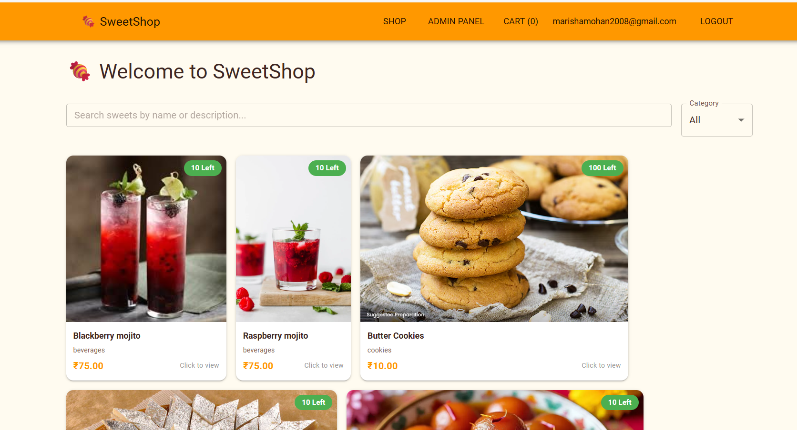
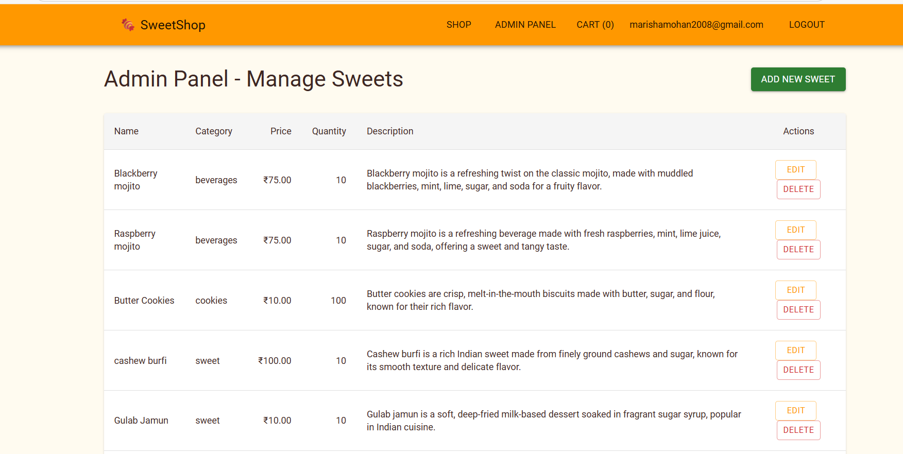
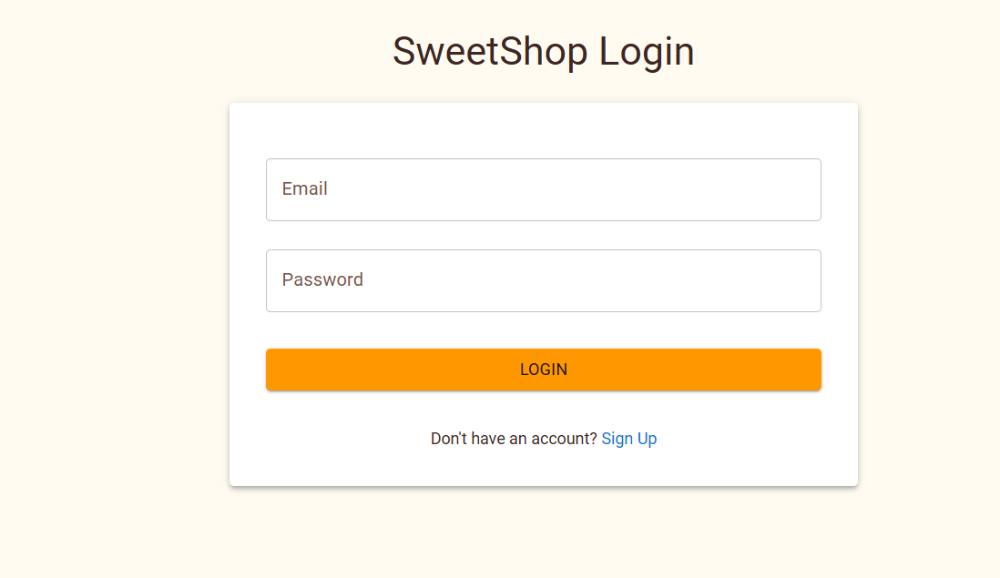
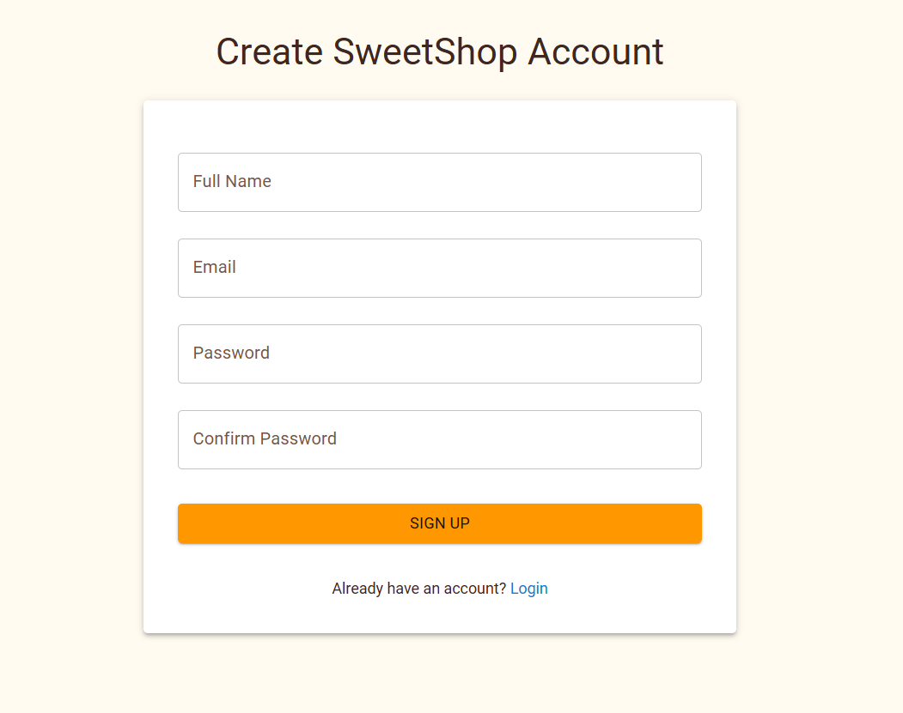
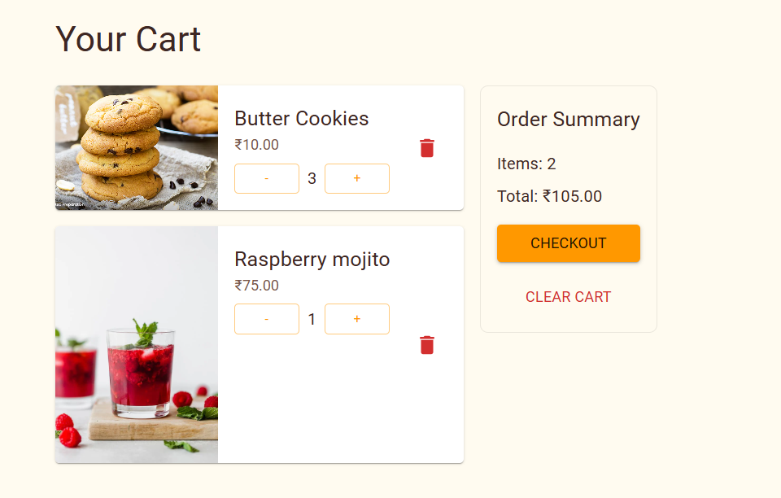
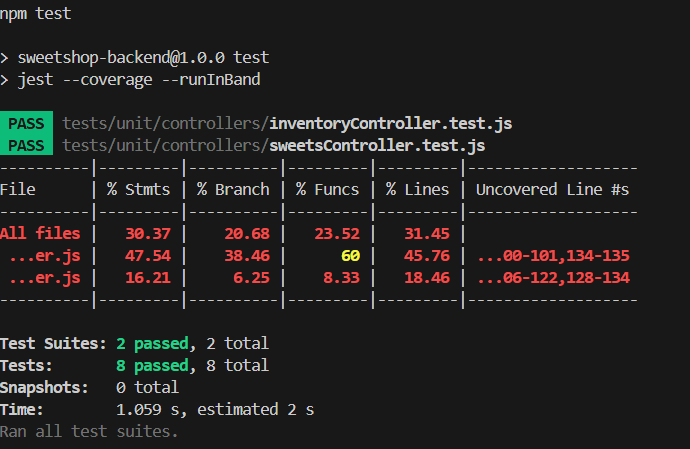

# Sweet Shop Management System

A full-stack web application for managing a sweet shop's inventory, sales, and user management.

---
## Deployed Link:- https://sweetshop-frontend-tsnz.onrender.com
## Features

- User authentication (Login/Register)
- Role-based access control (Admin/User)
- Product management (Add/Edit/Delete sweets)
- Inventory management
- Shopping cart functionality
- Responsive design

---

## Tech Stack

- **Frontend**: React, Redux, Material-UI  
- **Backend**: Node.js, Express, Firebase (Firestore, Authentication)  
- **Testing**: Jest, Supertest  
- **Version Control**: Git, GitHub  

## Environment Setup

### Backend Setup

1. **Set up Environment Variables**  
   Create a `.env` file in the backend directory and add your Firebase configuration:
   ```env
   FIREBASE_PROJECT_ID=your-project-id
   FIREBASE_CLIENT_EMAIL=your-client-email
   FIREBASE_PRIVATE_KEY="your-private-key"
   ```

2. **Install Dependencies**
   ```bash
   npm install
   ```

3. **Start the Development Server**
   ```bash
   npm start
   ```

### Frontend Setup

1. **Navigate to frontend directory**
   ```bash
   cd src
   ```

2. **Install Dependencies**
   ```bash
   npm install
   ```

3. **Set up Firebase Configuration**  
   Create a `.env` file in the frontend directory and add your Firebase configuration:
   ```env
   REACT_APP_FIREBASE_API_KEY=your-api-key
   REACT_APP_FIREBASE_AUTH_DOMAIN=your-project.firebaseapp.com
   REACT_APP_FIREBASE_PROJECT_ID=your-project-id
   REACT_APP_FIREBASE_STORAGE_BUCKET=your-bucket.appspot.com
   REACT_APP_FIREBASE_MESSAGING_SENDER_ID=your-sender-id
   REACT_APP_FIREBASE_APP_ID=your-app-id
   ```

4. **Start the development server**
   ```bash
   npm start
   ```

## Running Tests

### Backend Tests
```bash
cd path/to/backend
npm test
```

### Frontend Tests
```bash
cd path/to/frontend
npm test
```

## Screenshots

### Dashboard


### Admin Panel


### Login Form


### Register Form


### Cart


### Test Coverage Report


## My AI Usage

### Tools Used
- GitHub Copilot

### How I Used AI

#### Debugging Assistance
- Used Copilot to help identify and fix errors in the codebase
- Got suggestions for error handling patterns and best practices

#### Test Development
- Leveraged Copilot to generate unit tests for backend controllers
- Used it to create test cases for various scenarios including edge cases

#### API Development
- Received suggestions for RESTful endpoint structures
- Got help with implementing middleware for authentication and authorization

#### Code Optimization
- Used Copilot to suggest more efficient algorithms and patterns
- Got recommendations for code organization and structure

### Impact on Workflow

- **Productivity**: Significantly reduced time spent on boilerplate code
- **Learning**: Helped understand new patterns and best practices
- **Quality**: Improved code quality through consistent patterns and error handling
- **Problem-Solving**: Provided alternative approaches to complex problems
